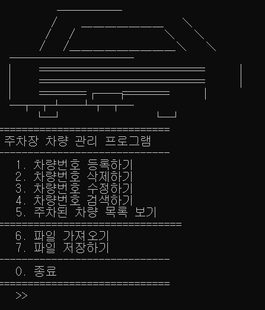

# 주차장 관리 프로그램

### 고급C프로그래밍 개인 프로젝트

## 개요
연결리스트를 활용하여 실제에 있을 법한 프로그램을 만들어보자.

## 개발 언어 및 환경
* Visual Studio
* C language

## 내용
자동차의 번호판 형식(ex) 12가3456)을 이용하여 새로운 노드를 추가, 삭제, 갱신, 검색 등의 기능을 구현하고

파일 입출력을 이용하여 현재 주차 현황을 저장 및 불러오는 기능을 구현하였다.

## 알게된 점
* 연결리스트에서 더미노드의 중요성
* 구조체안에 구조체를 가리키는 포인터를 만들어 사용하는 방법
* Head와 Tail 포인터의 중요성

## 시작 화면

